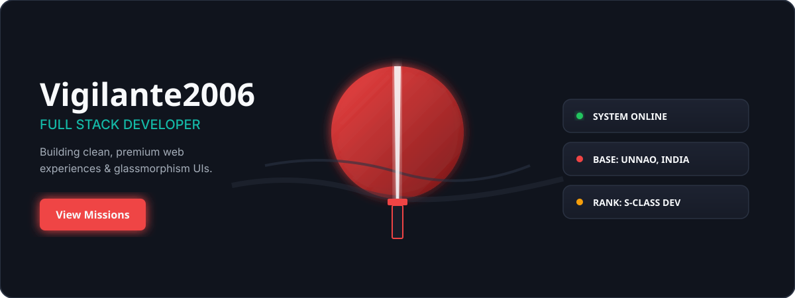
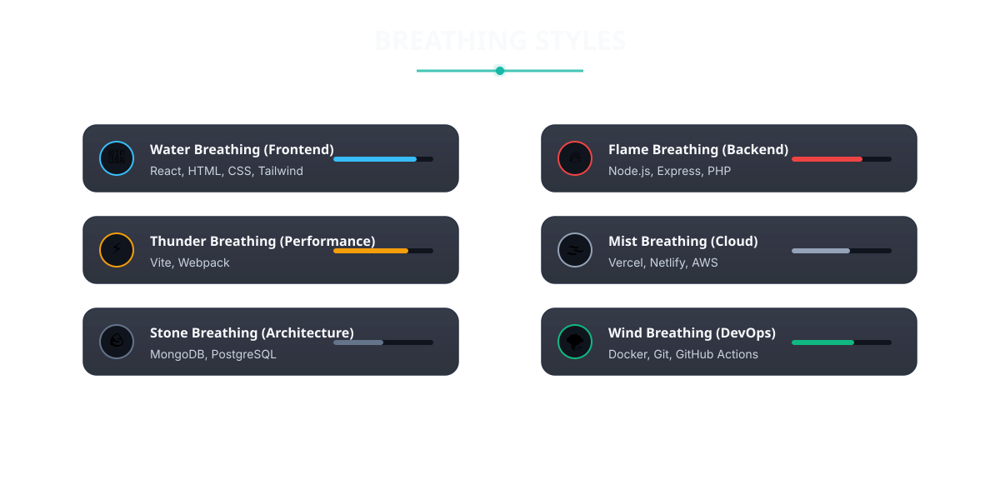
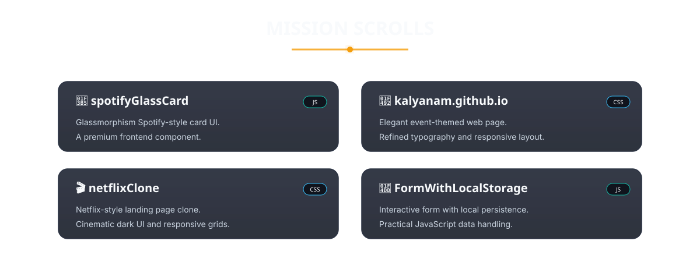

<!-- ═══════════════════════════════════════════════════════════════════════════
     VIGILANTE2006 — Premium Dashboard Profile (Demon Slayer Inspired)
     Fully immersive, SVG-driven layout. No restrictive grid tables.
     ═══════════════════════════════════════════════════════════════════════════ -->

  
   
  
  
   

  
   

  
   

  <!-- ─── CONTRIBUTION GRAPH (Infinity Castle) ─── -->
  
  
    

  <!-- ─── FOOTER & CONTACT ─── -->
  
  
  

    
    
  

  **© 2026 Vigilante2006**
   
  

