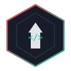
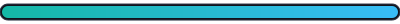
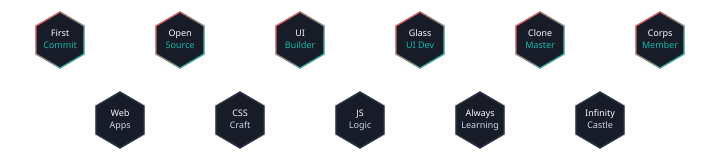

<!-- ═══════════════════════════════════════════════════════════════════════════
     VIGILANTE2006 — Demon Slayer Inspired GitHub Profile README
     Premium developer dashboard · Original artwork · GitHub-compatible
     ═══════════════════════════════════════════════════════════════════════════ -->

<div align="center">

<!-- ─── SECTION 1: ANIMATED HERO ─── -->


<br/><br/>



<h1>
  
</h1>

<p>
  
  
  
  
</p>

</div>

<!-- ─── SECTION 2: DEVELOPER INTRODUCTION ─── -->
<div align="center">

<table width="100%" style="max-width:1100px;border-collapse:separate;border-spacing:16px;">
<tr>
<td width="65%" valign="top">

<h3>⚔️ Developer Introduction</h3>

<pre>
╔══════════════════════════════════════════════════════════════╗
║  Corps Rank    │  Full Stack Developer                       ║
║  Focus         │  Web Development · UI/UX · Frontend       ║
║  Nichirin      │  JavaScript · CSS · HTML · React Ecosystem  ║
║  Mission       │  Craft readable, premium developer experiences║
╚══════════════════════════════════════════════════════════════╝
</pre>

<p>I'm <strong>Vigilante2006</strong> — a developer from <strong>Unnao, India</strong> who builds clean, glass-inspired web interfaces and clone projects that feel like premium product dashboards. I treat every repository like a <strong>mission scroll</strong> and every commit like a step toward mastery.</p>

<p><strong>Current Focus:</strong> Polishing my GitHub presence, building UI-heavy projects, and sharpening frontend craft through real-world clones and components.</p>

<p>
  <a href="https://github.com/Vigilante2006?tab=repositories">
    
  </a>
  <a href="https://rs2006.netlify.app/">
    
  </a>
  <a href="https://github.com/Vigilante2006/Vigilante2006/issues">
    
  </a>
</p>

<p><strong>Breathing Style:</strong> Water Breathing — Frontend Flow</p>



</td>
<td width="35%" valign="top">

<h3>📜 Corps Record</h3>

<table width="100%">
<tr><td align="left">🗂️ Repositories</td><td align="right"><strong>21</strong></td></tr>
<tr><td align="left">👥 Followers</td><td align="right"><strong>7</strong></td></tr>
<tr><td align="left">🔗 Following</td><td align="right"><strong>11</strong></td></tr>
<tr><td align="left">📅 Member Since</td><td align="right"><strong>Apr 2021</strong></td></tr>
<tr><td align="left">🌐 Portfolio</td><td align="right"><a href="https://rs2006.netlify.app/">rs2006.netlify.app</a></td></tr>
<tr><td align="left">📍 Base</td><td align="right">UNNAO, India</td></tr>
</table>

<br/>


</td>
</tr>
</table>

</div>


<!-- ─── SECTION 3: CURRENT MISSION ─── -->
<div align="center">

### 🎯 Current Mission

<table width="100%" style="max-width:1100px;border-collapse:separate;border-spacing:12px;">
<tr>
<td align="center" width="33%">

<p><strong>Mission Scroll #1</strong></p>

<p>🌊 Transform GitHub profile into a premium developer dashboard inspired by Japanese aesthetics and breathing-style discipline.</p>

</td>
<td align="center" width="33%">

<p><strong>Mission Scroll #2</strong></p>

<p>🔥 Build and refine UI clone projects — Spotify, Netflix, and glassmorphism components.</p>

</td>
<td align="center" width="33%">

<p><strong>Mission Scroll #3</strong></p>

<p>⚡ Level up frontend architecture, accessibility, and responsive design across all repos.</p>

</td>
</tr>
</table>

</div>


<!-- ─── SECTION 4: GITHUB STATISTICS ─── -->
<div align="center">

### 📊 Corps Statistics

<table width="100%" style="max-width:1100px;border-collapse:separate;border-spacing:12px;">
<tr>
<td align="center" width="50%">


</td>
<td align="center" width="50%">


</td>
</tr>
<tr>
<td align="center" width="50%">


</td>
<td align="center" width="50%">


</td>
</tr>
</table>

<br/>

<table width="100%" style="max-width:1100px;">
<tr>
<td align="center" width="25%"></td>
<td align="center" width="25%"></td>
<td align="center" width="25%"></td>
<td align="center" width="25%"></td>
</tr>
</table>

</div>


<!-- ─── SECTION 5: CONTRIBUTION GRAPH ─── -->
<div align="center">

### 🏯 Infinity Castle — Contribution Graph


<br/><br/>

<table width="100%" style="max-width:1100px;border-collapse:separate;border-spacing:16px;">
<tr>
<td align="center" width="50%">

<p><strong>🔥 Contribution Streak</strong></p>


</td>
<td align="center" width="50%">

<p><strong>🐍 Contribution Snake</strong></p>


</td>
</tr>
</table>

> **Note:** Enable the contribution snake by adding the [GitHub Actions workflow](./documentation/SETUP.md#contribution-snake) to this repository.

</div>


<!-- ─── SECTION 6: TECH STACK — BREATHING STYLES ─── -->
<div align="center">

### 🌊 Breathing Styles — Tech Stack

<table width="100%" style="max-width:1100px;border-collapse:separate;border-spacing:10px;">
<tr>
<td align="center" width="25%">

<br/>
<br/><strong>Water · Frontend</strong><br/>


</td>
<td align="center" width="25%">

<br/>
<br/><strong>Flame · Backend</strong><br/>


</td>
<td align="center" width="25%">

<br/>
<br/><strong>Thunder · Performance</strong><br/>


</td>
<td align="center" width="25%">

<br/>
<br/><strong>Mist · Cloud</strong><br/>


</td>
</tr>
<tr>
<td align="center" width="25%">

<br/>
<br/><strong>Stone · Architecture</strong><br/>


</td>
<td align="center" width="25%">

<br/>
<br/><strong>Wind · DevOps</strong><br/>


</td>
<td align="center" width="25%">

<br/>
<br/><strong>Love · UI/UX</strong><br/>


</td>
<td align="center" width="25%">

<br/>
<br/><strong>Beast · Problem Solving</strong><br/>


</td>
</tr>
</table>

<br/>

<p><strong>Top Languages — Corps Record</strong></p>


</div>


<!-- ─── SECTION 7: FEATURED REPOSITORIES ─── -->
<div align="center">

### 📜 Mission Scrolls — Featured Repositories

<table width="100%" style="max-width:1100px;border-collapse:separate;border-spacing:16px;">
<tr>
<td width="50%" valign="top">

<h4>🎵 <a href="https://github.com/Vigilante2006/spotifyGlassCard">spotifyGlassCard</a></h4>
  

<p>Glassmorphism Spotify-style card UI — a premium frontend component showcasing modern CSS techniques and visual polish.</p>

</td>
<td width="50%" valign="top">

<h4>💒 <a href="https://github.com/Vigilante2006/kalyanam.github.io">kalyanam.github.io</a></h4>
 

<p>Elegant event-themed web page with refined typography, layout structure, and responsive design patterns.</p>

</td>
</tr>
<tr>
<td width="50%" valign="top">

<h4>🎧 <a href="https://github.com/Vigilante2006/Spotify_Single_Page.github.io">Spotify_Single_Page.github.io</a></h4>
 

<p>Single-page Spotify-inspired layout focused on clean structure and music-app visual hierarchy.</p>

</td>
<td width="50%" valign="top">

<h4>🎬 <a href="https://github.com/Vigilante2006/netflixClone.github.io">netflixClone.github.io</a></h4>
  

<p>Netflix-style landing page clone — cinematic dark UI with hero sections and responsive card grids.</p>

</td>
</tr>
<tr>
<td width="50%" valign="top">

<h4>📝 <a href="https://github.com/Vigilante2006/FormWithLocalStorage">FormWithLocalStorage</a></h4>
 

<p>Interactive form with localStorage persistence — practical JavaScript patterns for client-side data handling.</p>

</td>
<td width="50%" valign="top">

<h4>🚩 <a href="https://github.com/Vigilante2006/flag">flag</a></h4>
 

<p>Creative CSS flag animation — demonstrates pure CSS artistry and geometric precision.</p>

</td>
</tr>
</table>

</div>


<!-- ─── SECTION 8: PROJECT MISSIONS ─── -->
<div align="center">

### ⚔️ Active Project Missions

| Priority | Mission | Status | Tech |
|:--------:|:--------|:------:|:-----|
| 🔴 High | Premium GitHub Profile Dashboard | 🟢 Active | Markdown · SVG · HTML |
| 🟠 Medium | Spotify Glass Card Component | 🟢 Active | JavaScript · CSS |
| 🟠 Medium | Netflix Clone Landing Page | 🟢 Active | CSS · HTML |
| 🟡 Low | Weather App Enhancement | 🟡 Planned | JavaScript |
| 🟡 Low | Portfolio Site Refresh | 🟡 Planned | React · Netlify |

</div>


<!-- ─── SECTION 9: DEVELOPER JOURNEY ─── -->
<div align="center">

### 🗾 Developer Journey

```
  Apr 2021          2022              2023              2024              2025              2026
     │                │                 │                 │                 │                 │
     ▼                ▼                 ▼                 ▼                 ▼                 ▼
┌─────────┐    ┌─────────────┐   ┌─────────────┐   ┌─────────────┐   ┌─────────────┐   ┌─────────────┐
│ Joined  │    │ First UI    │   │ Clone       │   │ CSS Craft   │   │ Glass UI    │   │ Premium     │
│ GitHub  │───▶│ Projects    │──▶│ Projects    │──▶│ & Forms     │──▶│ Components  │──▶│ Profile     │
│ Corps   │    │ HTML/CSS    │   │ Netflix/    │   │ LocalStorage│   │ Spotify     │   │ Dashboard   │
└─────────┘    └─────────────┘   │ Spotify     │   └─────────────┘   └─────────────┘   └─────────────┘
                                  └─────────────┘                                              │
                                                                                               ▼
                                                                                        ┌─────────────┐
                                                                                        │  Infinity   │
                                                                                        │   Castle    │
                                                                                        │  (Future)   │
                                                                                        └─────────────┘
```

</div>


<!-- ─── SECTION 10: ACHIEVEMENTS ─── -->
<div align="center">

### 🏅 Hashira Badges — Achievements



<br/><br/>


</div>


<!-- ─── SECTION 11: RECENT ACTIVITY ─── -->
<div align="center">

### 📡 Kasugai Crow — Recent Activity

<!--START_SECTION:activity-->
| Time | Event | Repository |
|:-----|:------|:-----------|
| Recent | 🚀 Pushed commits | [Vigilante2006](https://github.com/Vigilante2006/Vigilante2006) |
| Recent | 🏗️ Created profile repo | [Vigilante2006](https://github.com/Vigilante2006/Vigilante2006) |
| Ongoing | 🎨 UI clone development | [spotifyGlassCard](https://github.com/Vigilante2006/spotifyGlassCard) |
| Ongoing | 🎬 Netflix clone polish | [netflixClone.github.io](https://github.com/Vigilante2006/netflixClone.github.io) |
| Ongoing | 💒 Event page styling | [kalyanam.github.io](https://github.com/Vigilante2006/kalyanam.github.io) |
<!--END_SECTION:activity-->

> Enable live activity updates with the [Recent Activity workflow](./documentation/SETUP.md#live-activity-feed).

</div>


<!-- ─── SECTION 12: CONTACT ─── -->
<div align="center">

### 🤝 Let's Connect — Demon Slayer Corps Network

<p>
  <a href="https://github.com/Vigilante2006">
    
  </a>
  <a href="https://rs2006.netlify.app/">
    
  </a>
  <a href="https://github.com/Vigilante2006/Vigilante2006/issues">
    
  </a>
</p>

</div>


<!-- ─── SECTION 13: FOOTER ─── -->
<div align="center">


<br/>

**© 2026 Vigilante2006**

*Building with passion and lots of coffee · Keep learning. Keep growing.*

<br/>


<br/><br/>

<sub>Original artwork only · No copyrighted characters · Inspired by Japanese aesthetics and breathing-style discipline</sub>

</div>
